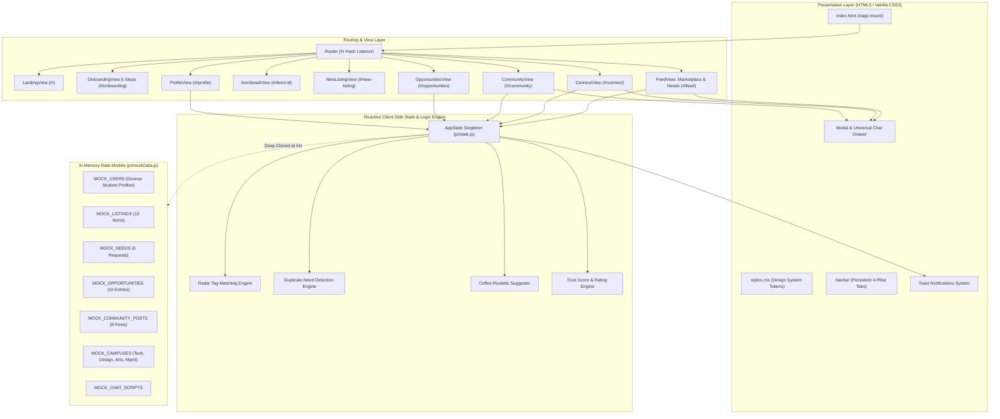
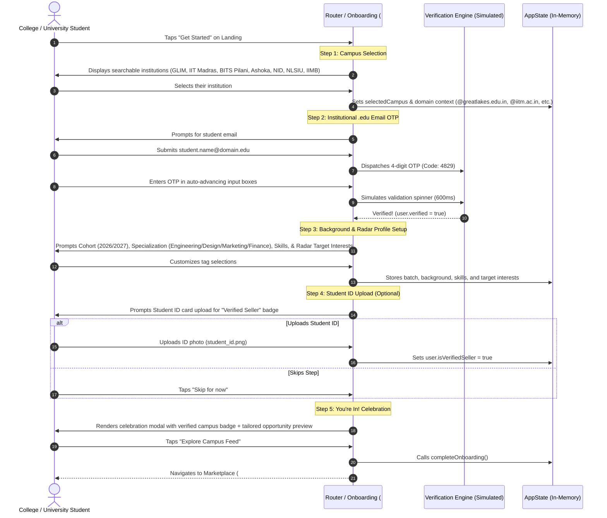
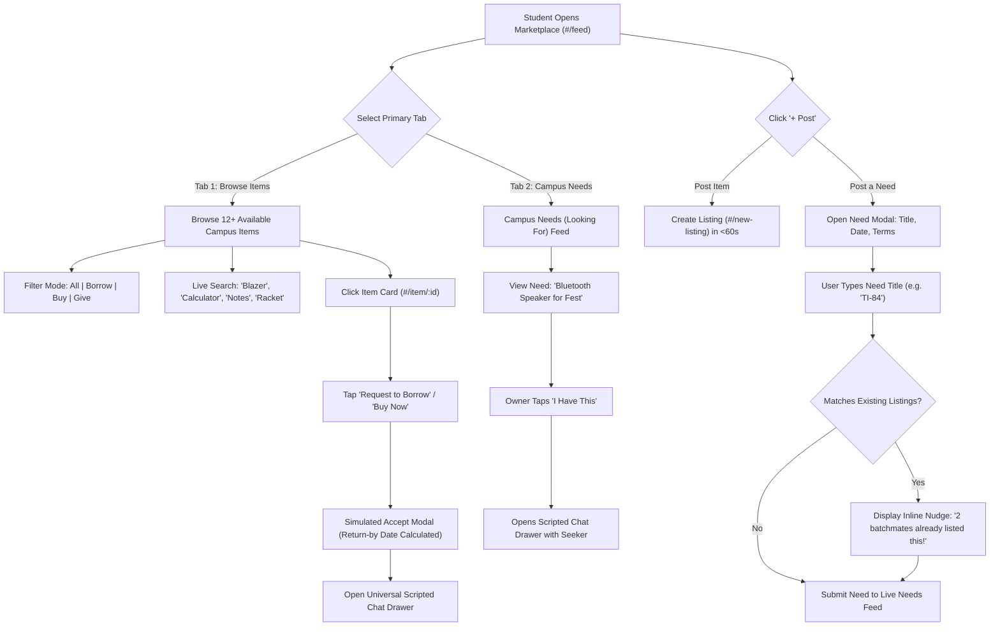
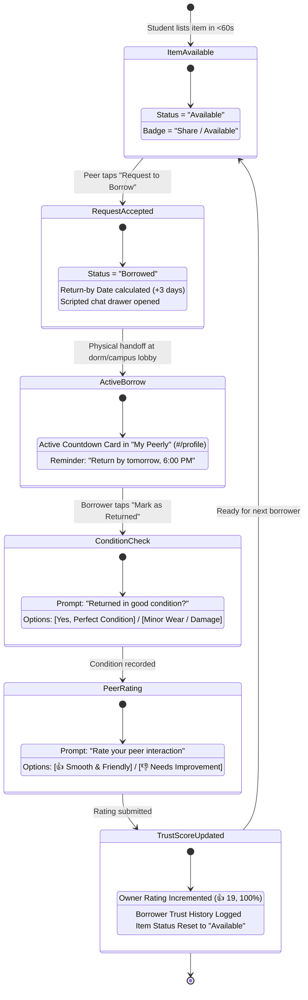
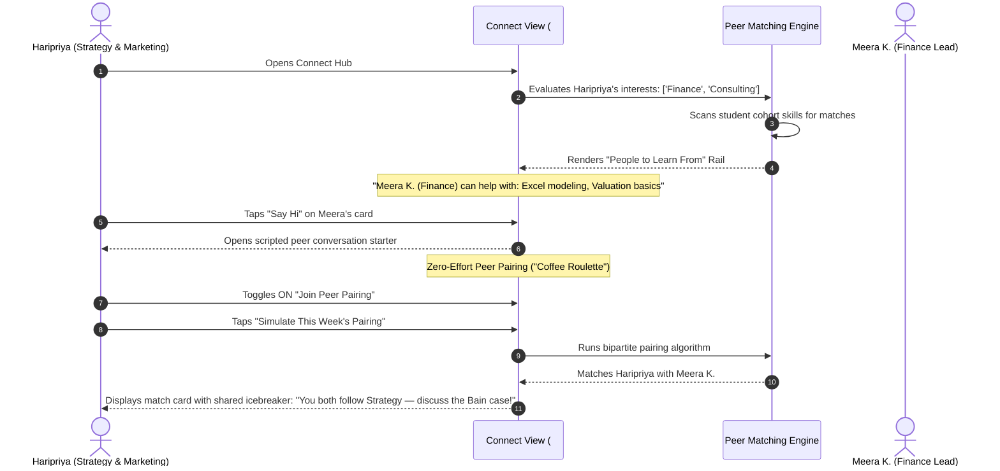
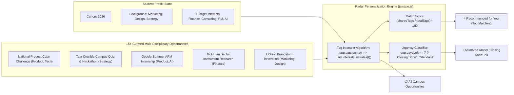
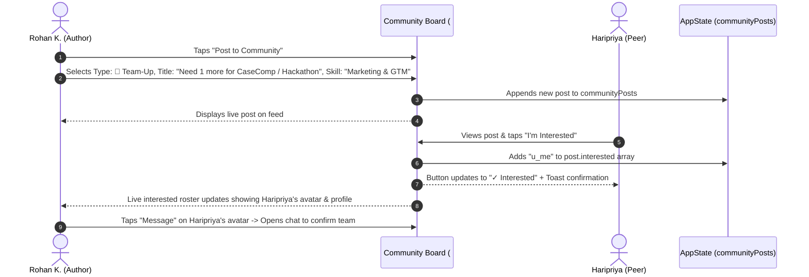

# 🎓 Peerly v2 — The Campus Operating System
**"Your Campus, Fully Connected."**

> **Peerly v2** is a comprehensive **Campus Operating System** engineered for colleges, universities, and higher education institutions worldwide. Built on deep campus research, Peerly integrates all four student exchange pillars into a single trusted, closed-network platform: **Things** (Marketplace & Reverse Needs), **Skills** (Connect Hub & Biweekly Peer Pairing), **Help** (Community Board & Team-Ups), and **Knowledge** (Personalized Opportunities Radar).

[](file:///c:/Users/pavit/Documents/MBA/2025/PROJECTS/peerly/index.html)
[](file:///c:/Users/pavit/Documents/MBA/2025/PROJECTS/peerly/styles.css)
[](file:///c:/Users/pavit/Documents/MBA/2025/PROJECTS/peerly/js/mockData.js)
[](file:///c:/Users/pavit/Documents/MBA/2025/PROJECTS/peerly/peerly-v2-spec.md)

---

## 📌 Table of Contents

1. [🌟 Executive Summary & The Generic Campus Thesis](#-executive-summary--the-generic-campus-thesis)
2. [🏛️ The 4 Product Pillars (Universal Student Exchange)](#️-the-4-product-pillars)
3. [🏗️ System Architecture & Interactive Diagrams](#️-system-architecture--interactive-diagrams)
   - [3.1 High-Level Component & Data Flow Architecture](#31-high-level-component--data-flow-architecture)
   - [3.2 5-Step Enriched Onboarding & Institutional Verification](#32-5-step-enriched-onboarding--institutional-verification)
   - [3.3 Dual-Track Marketplace & Reverse Needs Engine](#33-dual-track-marketplace--reverse-needs-engine)
   - [3.4 Closed-Loop Campus Accountability State Machine](#34-closed-loop-campus-accountability-state-machine)
   - [3.5 Connect Hub & Peer Pairing Coffee Roulette](#35-connect-hub--peer-pairing-coffee-roulette)
   - [3.6 Opportunities Radar Client-Side Matching Engine](#36-opportunities-radar-client-side-matching-engine)
   - [3.7 Community Board Team-Up Lifecycle](#37-community-board-team-up-lifecycle)
4. [🚀 Universal Feature Specifications & Implementation](#-universal-feature-specifications--implementation)
5. [🔄 Multi-Disciplinary Personas & Simulation Walkthroughs](#-multi-disciplinary-personas--simulation-walkthroughs)
6. [💻 Technical Implementation & Code Examples](#-technical-implementation--code-examples)
7. [📊 Mock Data Schema & Pre-Seeded Inventory](#-mock-data-schema--pre-seeded-inventory)
8. [📂 PlantUML Diagram Suite (.puml Files)](#-plantuml-diagram-suite-puml-files)
9. [🔮 Production Roadmap & PM Defense Guide](#-production-roadmap--pm-defense-guide)
10. [⚡ Quickstart & Local Setup](#-quickstart--local-setup)

---

## 🌟 Executive Summary & The Generic Campus Thesis

### 1.1 The Universal Campus Friction
On virtually every college, institute, or university campus (engineering, design, arts, medicine, law, or business), resource exchange and student networking are fragmented:
- **Idle Assets:** Thousands of textbooks, graphing calculators, lab equipment, monitors, cameras, sports gear, and interview attire sit idle in dorms and hostels.
- **Disconnected Talent:** Students lack a low-friction way to discover cross-departmental peers (e.g., engineers seeking designers for hackathons, marketers seeking financial modelers, researchers seeking coders).
- **Buried Requests:** WhatsApp/Telegram batch groups are noisy, lossy, and unsearchable. An ask posted at noon is buried under 300 messages by evening.
- **Accountability Vacuum:** Informal lending between peers suffers from awkward reminders and lost items due to zero return tracking.
- **Opportunity FOMO:** National hackathons, case competitions, fellowships, and grants are scattered across dozens of portals (Unstop, LinkedIn, university notice boards), leading to missed deadlines.

```
                          GENERIC CLASSIFIEDS (OLX / Jugarr / WhatsApp)
                                    ┌──────────────┐
                                    │    Things    │
                                    └──────────────┘
                                           │
                                           ▼
                           PEERLY v2 CAMPUS OPERATING SYSTEM
                     ┌─────────────────────┬─────────────────────┐
                     │       Things        │       Skills        │
                     │ (Marketplace+Needs) │  (Connect Pairing)  │
                     ├─────────────────────┼─────────────────────┤
                     │        Help         │      Knowledge      │
                     │  (Community Board)  │ (Opportunities Radar│
                     └─────────────────────┴─────────────────────┘
```

> **Universal Positioning Statement:** *Peerly isn't just a campus buy-and-sell board. It is the single operating system a student opens for everything campus-related — trade what you have, meet who you should know across departments, ask for help when you're stuck, and discover every opportunity you're eligible for — instead of five chaotic WhatsApp groups, three disjointed apps, and a lot of luck.*

---

## 🏛️ The 4 Product Pillars

| Pillar | Campus Problem Solved | Product Surface | Core Mechanism | Technical Implementation |
|---|---|---|---|---|
| **Things** | Idle dorm gear & hidden campus supply | [Marketplace & Needs Feed](file:///c:/Users/pavit/Documents/MBA/2025/PROJECTS/peerly/js/views/feed.js) | Dual-track feed: Browse items + Reverse "Looking For" needs with live duplicate detection nudge and "I Have This" handoff. | [feed.js](file:///c:/Users/pavit/Documents/MBA/2025/PROJECTS/peerly/js/views/feed.js), [itemDetail.js](file:///c:/Users/pavit/Documents/MBA/2025/PROJECTS/peerly/js/views/itemDetail.js), [newListing.js](file:///c:/Users/pavit/Documents/MBA/2025/PROJECTS/peerly/js/views/newListing.js) |
| **Skills** | Siloed departments & networking awkwardness | [Connect & Pairing Hub](file:///c:/Users/pavit/Documents/MBA/2025/PROJECTS/peerly/js/views/connect.js) | Cross-domain skill exchange ("People to learn from" + "People like you") + Zero-effort biweekly Peer Pairing ("Coffee Roulette"). | [connect.js](file:///c:/Users/pavit/Documents/MBA/2025/PROJECTS/peerly/js/views/connect.js), [modal.js](file:///c:/Users/pavit/Documents/MBA/2025/PROJECTS/peerly/js/components/modal.js) |
| **Help** | Fragmented hackathon teaming & favor requests | [Community Board](file:///c:/Users/pavit/Documents/MBA/2025/PROJECTS/peerly/js/views/community.js) | Competition & Hackathon `🤝 Team-Up` with live batchmate interest roster, `🙋 Ask / Favor` requests, and `📢 Announcement` milestones. | [community.js](file:///c:/Users/pavit/Documents/MBA/2025/PROJECTS/peerly/js/views/community.js), [modal.js](file:///c:/Users/pavit/Documents/MBA/2025/PROJECTS/peerly/js/components/modal.js) |
| **Knowledge** | Scattered deadlines & opportunity discovery | [Opportunities Radar](file:///c:/Users/pavit/Documents/MBA/2025/PROJECTS/peerly/js/views/opportunities.js) | Client-side tag-matching engine filtering 15+ curated competitions, grants, and internships against student interests with 7-day "Closing Soon" badges. | [opportunities.js](file:///c:/Users/pavit/Documents/MBA/2025/PROJECTS/peerly/js/views/opportunities.js), [state.js](file:///c:/Users/pavit/Documents/MBA/2025/PROJECTS/peerly/js/state.js) |

---

## 🏗️ System Architecture & Interactive Diagrams

### 3.1 High-Level Component & Data Flow Architecture



---

### 3.2 5-Step Enriched Onboarding & Institutional Verification



---

### 3.3 Dual-Track Marketplace & Reverse Needs Engine



---

### 3.4 Closed-Loop Campus Accountability State Machine



---

### 3.5 Connect Hub & Peer Pairing Coffee Roulette



---

### 3.6 Opportunities Radar Client-Side Matching Engine



---

### 3.7 Community Board Team-Up Lifecycle



---

## 🚀 Universal Feature Specifications & Implementation

### 1. Pillar 1: Things — Marketplace & Reverse Needs Engine
- **Dual-Track Feed Tabs:** Seamless switching between **"Browse Available Items"** (12+ items) and **"Campus Needs (Looking For)"** (6+ requests).
- **Reverse Seeker Requests:** Students post what they are seeking with needed-by dates and terms (`Borrow Only`, `Willing to Pay`, `Either`).
- **"I Have This" Instant Response:** Any verified student can respond to a Need card, instantly launching a scripted handoff chat without needing an existing listing.
- **Simulated Duplicate Match Nudge:** Live typing during Need creation runs a substring/category match against active inventory. If an item exists, an amber alert banner guides the user to the existing listing.

### 2. Pillar 2: Skills — Connect Hub & Peer Pairing
- **"People to Learn From" Rail:** Dynamic student cards displaying peers whose skills match your stated learning interests, complete with an explanation (*"Meera (Finance) can help with: Excel modeling, Valuation basics"*).
- **"People Like You" Rail:** Overlapping cohort and specialization peers for study circles and projects.
- **Zero-Effort Peer Pairing ("Coffee Roulette"):** Biweekly opt-in toggle + "Simulate This Week's Pairing" demo trigger with mutual icebreakers.
- **Interactive Skill/Interest Customizer:** Modal allowing real-time edits to user skills and radar interests.

### 3. Pillar 3: Help — Community Board
- **Three Core Post Types:**
  - `🤝 Team-Up`: Form case competition, research, or hackathon teams with role requirements, deadline trackers, and an interactive **"I'm Interested"** batchmate roster.
  - `🙋 Ask / Favor`: Informal requests for SOP reviews, mock interviews, lab notes, or lost item recovery.
  - `📢 Announcement`: Campus achievements, club webinars, podcast releases, and student initiatives.
- **Interactive Emoji Reactions:** Real-time reaction counters for 👍 Thumbs Up, 🎉 Celebrate, and 🔥 Fire.

### 4. Pillar 4: Knowledge — Personalized Opportunities Radar
- **Client-Side Tag Matching:** Real-time array intersection filtering against `currentUser.interests`.
- **"Recommended for You" Tier:** Highlighting highest-relevance opportunities with match percentage badges.
- **"Closing Soon" Alerts:** Animated amber urgency pills for competitions closing within 7 days.
- **Multi-Source Curation:** Curated listings from Unstop, LinkedIn Jobs, Tata Group, BCG Campus, and Campus Notice Boards.

---

## 🔄 Multi-Disciplinary Personas & Simulation Walkthroughs

Use the top **Persona Demo Bar** to switch between pre-seeded personas representing diverse campus disciplines:

```
┌─────────────────────────────────────────────────────────────────────────────────────────────┐
│ 👤 Demo Persona Bar: [ Haripriya M. (Marketing) ▼ ] [ Reset Demo Data ]  [ GLIM Chennai ▼ ] │
└─────────────────────────────────────────────────────────────────────────────────────────────┘
```

### Persona Matrix

| ID | Persona | Specialization & Focus | Skills Offered | Target Interests | Key Simulation Role |
|---|---|---|---|---|---|
| `u_me` | **Haripriya M.** | Strategy & Marketing | GTM Strategy, Pitch Decks, Public Speaking | Finance, Consulting, PM, Analytics | Demand Seeker, Case Competitor, Peer Learner |
| `u_jean` | **Jean R.** | Economics & Finance | Excel modeling, DCF Analysis, Corporate Tax | Consulting, Venture Capital, Fintech | Passive Idle Owner (Lends TI-84 & Textbooks) |
| `u_meera` | **Meera K.** | Finance & Investments | Valuation basics, LBO Modeling, M&A | Product Management, AI Tools, Consulting | Skill Mentor, Coffee Roulette Partner |
| `u_thiru` | **Thirupathi M.** | Operations & Supply Chain | Six Sigma, Vendor Sourcing, Logistics | E-Commerce, Retail Tech, Operations | Verified Bulk Reseller (Water Bottles & Essentials) |
| `u_rohan` | **Rohan K.** | Consulting & Strategy | Case Structuring, Guesstimates | Strategy, Tech Consulting | CaseComp Team Lead, Blazer Lender |
| `u_priya` | **Priya S.** | Design & Digital Media | Figma Prototyping, UI/UX, Copywriting | Product Management, Design, Marketing | Creative Designer, Textbook Seller |

---

### Step-by-Step Simulation Examples

#### Example 1: Borrowing Formal Attire for Final Presentations (Pillar: Things)
1. Navigate to **Marketplace** (`#/feed`). Ensure the **"Browse Available Items"** tab is active.
2. Type `"Blazer"` into the search bar or click the **"Formal Wear"** category chip.
3. Click on the listing **"Navy Blue Formal Blazer (Size 40 / M)"** (`#/item/l1`).
4. Note the owner (Rohan K., 100% Rating, Hostel 3) and status (**Available**).
5. Click **"Request to Borrow"**. A simulated 500ms spinner completes, displaying:
   - *Status:* **Borrowed**
   - *Return-by Date:* **Tomorrow, 6:00 PM**
6. Click **"Open Scripted Chat"**. Review the pre-scripted handoff dialog coordinating a lobby pickup at Hostel 3.

#### Example 2: Reverse Need with Duplicate Detection (Pillar: Things)
1. On the Marketplace feed, click **"Post a Need"** or switch to the **"Campus Needs"** tab.
2. In the modal, type `"TI-84 Calculator"` in the title field.
3. Observe the live **Duplicate Detection Nudge Banner**:
   > *"Good news — Jean R. already listed 'TI-84 Plus CE Graphing Calculator' for borrow! Check existing listings before posting."*
4. Change the title to `"Bluetooth Speaker for Campus Terrace"`, set Needed-by Date to `2026-09-14`, select `"Borrow Only"`, and submit.
5. The new card immediately appears at the top of the **Campus Needs** feed.
6. Switch persona to **Jean R.** -> Jean sees the need and can tap **"I Have This"** to open a handoff chat.

#### Example 3: Cross-Department Skill Swap & Coffee Roulette (Pillar: Skills)
1. Navigate to **Connect** (`#/connect`).
2. Observe the **"People to Learn From"** rail. Because Haripriya's interests include *Finance*, Meera K. and Jean R. appear with reason pills:
   - *"Meera K. (Finance) can help with: Excel modeling, Valuation basics"*
3. Click **"Say Hi"** on Meera's card to launch the peer chat starter.
4. In the **Peer Pairing ("Coffee Roulette")** section, click **"Simulate This Week's Pairing"**.
5. The preview card updates with paired peer Meera K., the mutual topic (*Finance & Valuation Modeling*), and an icebreaker prompt (*"Ask Meera about her breakdown of the Bajaj Auto valuation case!"*).

#### Example 4: Case Competition / Hackathon Team-Up (Pillar: Help)
1. Navigate to **Community Board** (`#/community`).
2. Filter by the **"🤝 Team-Ups"** chip.
3. Locate post `c1`: *"Need 1 more for CaseComp Nationals (Marketing / GTM focus)"* by Rohan K.
4. Click **"I'm Interested"**. The button updates to **"✓ Interested"**, a success toast fires, and Haripriya's avatar appears in the live roster of interested students.
5. Click **"Post to Community"** to open the composer and publish a new Ask or Announcement.

#### Example 5: Opportunities Radar Personalization (Pillar: Knowledge)
1. Navigate to **Opportunities** (`#/opportunities`).
2. Observe that the **"Recommended for You"** section highlights:
   - *National Product Case Challenge* (Tags: Product, Strategy)
   - *Google Summer APM Intern* (Tags: Product, AI Tools)
   - *Goldman Sachs Investment Research* (Tags: Finance, Markets)
3. Notice the animated amber **"Closing in 3 days"** badge on urgent competitions.
4. Click **"Customize My Radar Tags"**, add `"Fintech"`, and click save. Watch the feed re-filter immediately in real-time.

#### Example 6: Closed-Loop Return & Trust Score Bump (Accountability)
1. Navigate to **My Peerly Profile** (`#/profile`).
2. Under **Active Borrows**, locate the Navy Blazer card with the countdown reminder: *"Return by tomorrow, 6:00 PM"*.
3. Click **"Mark as Returned"**.
4. In Step 1 of the modal, select **"Yes, Perfect Condition"**.
5. In Step 2, select **"👍 Smooth & Friendly"**.
6. Submit: The active borrow card clears, and Rohan's trust rating increments to **👍 19 (100%)**.

---

## 💻 Technical Implementation & Code Examples

### 1. In-Memory Reactive State Management ([js/state.js](file:///c:/Users/pavit/Documents/MBA/2025/PROJECTS/peerly/js/state.js))
Peerly maintains an in-memory singleton `AppState` with a subscriber pattern for zero-reload reactive updates:

```javascript
class AppState {
  constructor() {
    this.listeners = [];
    this.resetState();
  }

  resetState() {
    this.listings = JSON.parse(JSON.stringify(MOCK_LISTINGS));
    this.users = JSON.parse(JSON.stringify(MOCK_USERS));
    this.needs = JSON.parse(JSON.stringify(MOCK_NEEDS));
    this.opportunities = JSON.parse(JSON.stringify(MOCK_OPPORTUNITIES));
    this.communityPosts = JSON.parse(JSON.stringify(MOCK_COMMUNITY_POSTS));
    this.currentUser = { ...this.users[0] }; // Haripriya M.
    this.notify();
  }

  subscribe(callback) {
    this.listeners.push(callback);
    return () => { this.listeners = this.listeners.filter(cb => cb !== callback); };
  }

  notify() {
    this.listeners.forEach(cb => cb(this));
  }
}
```

### 2. Client-Side Radar Personalization Engine ([js/state.js](file:///c:/Users/pavit/Documents/MBA/2025/PROJECTS/peerly/js/state.js))

```javascript
getPersonalizedOpportunities() {
  const userInterests = this.currentUser?.interests || [];
  
  const recommended = [];
  const allOthers = [];

  this.opportunities.forEach(opp => {
    // Real client-side tag overlap matching
    const matchingTags = opp.tags.filter(tag => userInterests.includes(tag));
    const isRecommended = matchingTags.length > 0;
    
    // Urgency calculation (< 7 days)
    const daysLeft = this.calculateDaysLeft(opp.deadline);
    const isClosingSoon = daysLeft <= 7 && daysLeft >= 0;

    const enrichedOpp = {
      ...opp,
      matchingTags,
      matchPercentage: isRecommended ? Math.round((matchingTags.length / opp.tags.length) * 100) : 0,
      isClosingSoon,
      daysLeft
    };

    if (isRecommended) recommended.push(enrichedOpp);
    else allOthers.push(enrichedOpp);
  });

  return { recommended, allOthers, total: this.opportunities.length };
}
```

### 3. Duplicate Need Detection Algorithm ([js/components/modal.js](file:///c:/Users/pavit/Documents/MBA/2025/PROJECTS/peerly/js/components/modal.js))

```javascript
checkDuplicateNeedMatch(inputTitle) {
  if (!inputTitle || inputTitle.trim().length < 3) return null;
  const clean = inputTitle.toLowerCase().trim();
  
  return appState.listings.find(item => {
    const itemTitle = item.title.toLowerCase();
    const itemCat = item.category.toLowerCase();
    return itemTitle.includes(clean) || clean.includes(itemTitle.slice(0, 5)) || itemCat.includes(clean);
  });
}
```

### 4. Hash Router with Route Parameters ([js/router.js](file:///c:/Users/pavit/Documents/MBA/2025/PROJECTS/peerly/js/router.js))

```javascript
const routes = {
  "/": LandingView,
  "/onboarding": OnboardingView,
  "/feed": FeedView,
  "/item/:id": ItemDetailView,
  "/new-listing": NewListingView,
  "/connect": ConnectView,
  "/community": CommunityView,
  "/opportunities": OpportunitiesView,
  "/profile": ProfileView
};

function handleRoute() {
  const hash = window.location.hash.slice(1) || "/";
  const matchedView = resolveRoute(hash, routes);
  document.getElementById("app").innerHTML = matchedView.render();
  window.scrollTo(0, 0);
}
window.addEventListener("hashchange", handleRoute);
window.addEventListener("DOMContentLoaded", handleRoute);
```

---

## 📊 Mock Data Schema & Pre-Seeded Inventory

### Data Models Summary

```
┌─────────────────┐       ┌─────────────────┐       ┌─────────────────┐
│   MOCK_USERS    │◄─────►│  MOCK_LISTINGS  │◄─────►│   MOCK_NEEDS    │
│  (6 Profiles)   │       │   (12 Items)    │       │  (6 Requests)   │
└────────┬────────┘       └─────────────────┘       └─────────────────┘
         │
         ├───────────────►┌─────────────────────┐
         │                │ MOCK_COMMUNITY_POSTS│
         │                │     (8 Posts)       │
         │                └─────────────────────┘
         │
         └───────────────►┌─────────────────────┐
                          │ MOCK_OPPORTUNITIES  │
                          │   (15 Curated)      │
                          └─────────────────────┘
```

- **Campuses (`MOCK_CAMPUSES`):** Multi-disciplinary coverage across engineering, management, design, liberal arts, and sciences (GLIM, IIT Madras, BITS Pilani, Ashoka University, NID, IIM Bangalore, NLSIU).
- **Users (`MOCK_USERS`):** 6 diverse profiles with batch year, specialization, verified flags, ratings, bio, skills, and target interests.
- **Listings (`MOCK_LISTINGS`):** 12 items across Formal Wear, Electronics, Books & Notes, Sports Gear, and Bulk Resale with photos, terms, and status (`available`, `borrowed`, `sold`).
- **Needs (`MOCK_NEEDS`):** 6 reverse requests (Bluetooth Speaker, Lab Coat, TI-84, Marketing Case Study, Table Lamp) with needed-by dates and terms (`borrow-only`, `willing-to-pay`, `either`).
- **Opportunities (`MOCK_OPPORTUNITIES`):** 15 curated competitions, hackathons, and scholarships across all disciplines.
- **Community Posts (`MOCK_COMMUNITY_POSTS`):** 8 multi-category posts with live reaction counts and interested student lists.
- **Chat Scripts (`MOCK_CHAT_SCRIPTS`):** Pre-scripted contextual message exchanges for items, needs, and peer connections.

---

## 📂 PlantUML Diagram Suite (.puml Files)

For formal UML documentation and PlantUML rendering tools, the project includes standalone PUML files in the [`diagrams/`](file:///c:/Users/pavit/Documents/MBA/2025/PROJECTS/peerly/diagrams) directory:

1. [diagrams/system-architecture.puml](file:///c:/Users/pavit/Documents/MBA/2025/PROJECTS/peerly/diagrams/system-architecture.puml) — Complete component layout, presentation layer, reactive state store, and matching engine interactions.
2. [diagrams/onboarding-flow.puml](file:///c:/Users/pavit/Documents/MBA/2025/PROJECTS/peerly/diagrams/onboarding-flow.puml) — Full 5-step sequence diagram for campus selection, OTP verification, profile enrichment, ID badge upload, and celebration.
3. [diagrams/persona-journeys.puml](file:///c:/Users/pavit/Documents/MBA/2025/PROJECTS/peerly/diagrams/persona-journeys.puml) — 7 comprehensive persona journeys spanning all 4 product pillars (Borrowing, Reverse Needs, Connect Hub, Community Team-Ups, Opportunities Radar, Resale, and Accountability).
4. [diagrams/accountability-loop.puml](file:///c:/Users/pavit/Documents/MBA/2025/PROJECTS/peerly/diagrams/accountability-loop.puml) — Closed-loop campus trust state machine from listing to handoff, return condition inspection, and peer rating bump.

---

## 🔮 Production Roadmap & PM Defense Guide

When presenting the Peerly prototype to evaluators or investors, use these architectural defense points:

### 1. "Why Front-End Only?"
> *"We deliberately scoped Peerly as a high-fidelity client-side prototype because at this stage the primary risk is not technical feasibility — it is trust, discoverability, and daily habit adoption. The prototype validates the complete user experience and UX craft before capital is committed to backend infrastructure."*

### 2. Production Implementation Path
- **Opportunities Radar in Production:** Scheduled serverless cron workers (AWS Lambda / Cloudflare Workers) scraping RSS/APIs (Unstop, LinkedIn, Internshala, University Portals), deduplicating records, running LLM/NLP embedding categorization, and generating daily digest emails/push notifications.
- **Connect Peer Pairing in Production:** A weighted bipartite matching algorithm factoring in domain diversity, schedule availability, and shared interests, automatically issuing Google/Outlook Calendar invites.
- **Community Board & Marketplace:** WebSockets/Firebase real-time synchronization, PostgreSQL relational store, and automated image moderation.

---

## ⚡ Quickstart & Local Setup

Peerly is built with **zero external dependencies, zero npm packages, and zero build steps**.

### Option 1: Direct File Open
Double-click [index.html](file:///c:/Users/pavit/Documents/MBA/2025/PROJECTS/peerly/index.html) in your file explorer to run directly in Google Chrome, Microsoft Edge, Safari, or Firefox.

### Option 2: Local HTTP Server
Run any local static server inside the project root:

```bash
# Python 3
python -m http.server 8000

# Node.js (npx)
npx serve .
```

Then visit `http://localhost:8000` in your web browser.

---

*Peerly v2 — The Multi-Campus Operating System for Higher Education Institutions*
