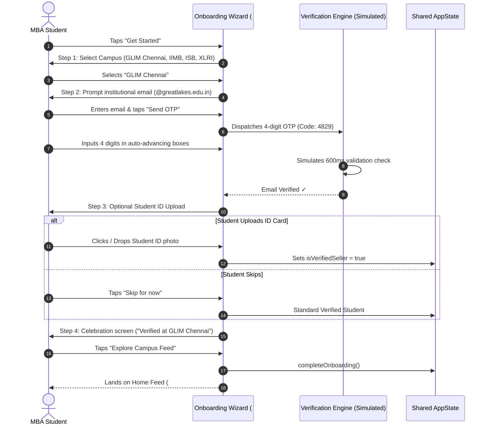
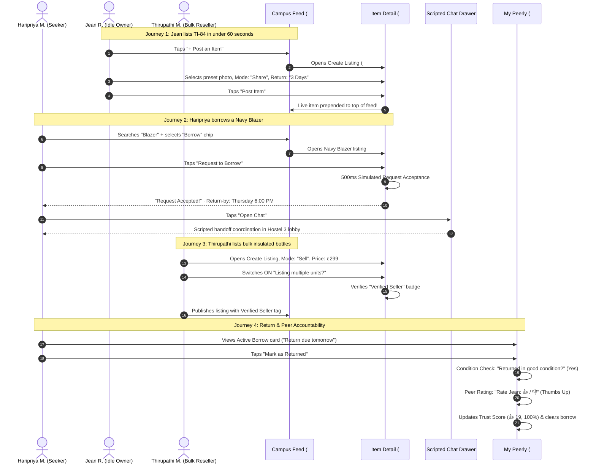
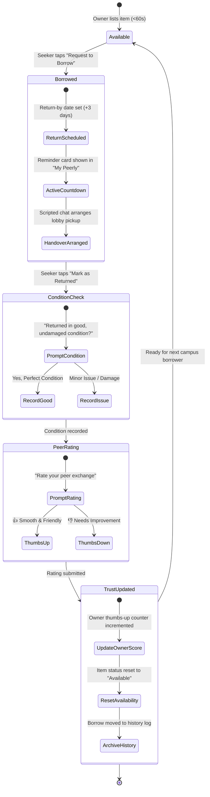

# 🎓 Peerly — Campus Peer-to-Peer Marketplace

> **"Share. Connect. Campus."**  
> A trusted, closed-loop peer-to-peer marketplace for residential MBA campuses — borrow formal blazers, find graphing calculators, buy/sell course books, share handwritten cheat sheets, and trade skills with verified batchmates.

[](file:///c:/Users/pavit/Documents/MBA/2025/PROJECTS/peerly/index.html)
[](file:///c:/Users/pavit/Documents/MBA/2025/PROJECTS/peerly/styles.css)
[](file:///c:/Users/pavit/Documents/MBA/2025/PROJECTS/peerly/js/mockData.js)
[-F5A742?style=for-the-badge)](file:///c:/Users/pavit/Documents/MBA/2025/PROJECTS/peerly/peerly-project-spec.md)

---

## 📌 Table of Contents

1. [🌟 Executive Summary & Problem Space](#-executive-summary--problem-space)
2. [👥 Core Campus Personas](#-core-campus-personas)
3. [🎯 Design Principles & Feature Mapping](#-design-principles--feature-mapping)
4. [🏛️ The 4 Exchange Pillars](#-the-4-exchange-pillars)
5. [🔄 Product Flows & Architecture (PlantUML & Visual Diagrams)](#-product-flows--architecture-plantuml--visual-diagrams)
   - [Flow 1: Campus Onboarding & Verification](#flow-1-campus-onboarding--verification)
   - [Flow 2: Persona User Journeys (Seeker, Owner, Reseller)](#flow-2-persona-user-journeys-seeker-owner-reseller)
   - [Flow 3: Closed-Loop Accountability Lifecycle](#flow-3-closed-loop-accountability-lifecycle)
9. [🔮 Product Roadmap & Future Architecture](#-product-roadmap--future-architecture)
10. [🚀 Quick Start & How to Run](#-quick-start--how-to-run)

---

## 🌟 Executive Summary & Problem Space

### 1.1 The One-Line Pitch
**Peerly turns a residential MBA hostel campus into a searchable, trusted marketplace** — so idle suits, calculators, notes, and coaching skills two corridors away find the exact batchmates who need them.

### 1.2 The Core Problem (From Campus Research)
On residential B-school campuses (like **GLIM Chennai, IIMs, ISB, XLRI**), students live in dense hostel clusters where urgent demand and idle supply co-exist side by side. Yet, discovery and exchange remain fundamentally broken:

```
┌─────────────────────────┐       BROKEN CONNECTION       ┌─────────────────────────┐
│     The Need Exists     │  ─────────────────────────►   │    The Supply Exists    │
│  - Urgent SIP suits     │     • WhatsApp is lossy       │  - Idle blazers in room │
│  - TI-84 for stats exam │     • Reach capped by batch   │  - Unused calculators   │
│  - Term 1 formula notes │     • Zero return tracking    │  - Past-term textbooks  │
│  - Mock case practice   │     • Selling feels spammy    │  - Consulting prep pros │
└─────────────────────────┘                               └─────────────────────────┘
```

> **The problem isn't scarcity. It is discoverability, access, and trust.**

### 1.3 Why Existing Channels Fail
| Channel | Failure Mode | Impact on Students |
|---|---|---|
| **WhatsApp Cohort Groups** | Broadcast push messages get buried in minutes; reach is strictly siloed to one's own batch section. | Students miss available items and default to buying new on Amazon. |
| **Direct Peer Inquiries** | High social friction; asking batchmates feels like begging or imposing. | Reluctance to ask unless in an emergency. |
| **Informal Reselling** | Posting items for sale in social groups feels transactional and spammy. | Student entrepreneurs & bulk resellers cannot scale past their immediate friend circle. |
| **Informal Lending** | No clear return deadlines; owners fear items being damaged or forgotten. | Owners prefer keeping valuable gear idle in closets rather than risking lending. |

---

## 👥 Core Campus Personas

Peerly is built directly around the 3 primary user personas discovered during design-thinking field research:

| Persona | Role in System | Core Need & Pain Point | How Peerly Solves It |
|---|---|---|---|
| <br>**Jean R.**<br>*(2nd Year PGPM, Finance)* | **Passive Idle Owner (Supply)** | Has suits, TI-84 calculators, and textbooks sitting idle after Term 1 & 2. Wants a low-effort way to lend items without having to chase people for returns. | • **<60s rapid listing** with smart defaults.<br>• Automated **return-by countdowns**.<br>• Built-in **condition checks** and peer ratings. |
| <br>**Haripriya M.**<br>*(1st Year PGPM, Marketing)* | **Seeker (Short-Term Demand)** | Needs a formal blazer for placement week and study notes before midterms. Hates WhatsApp spam and wants instant availability checks. | • **Live search & filter chips** (Borrow / Buy / Give).<br>• 1-tap **Request to Borrow**.<br>• Scripted **Hostel Chat** to coordinate quick lobby handoff. |
| <br>**Thirupathi M.**<br>*(2nd Year PGPM, Operations)* | **Bulk-Buyer-Reseller (Commerce)** | Procures wholesale study supplies (insulated flasks, notebooks) for batchmates. Needs an opt-in space where commerce feels professional, not spammy. | • **Verified Seller trust badge** unlocked via campus ID upload.<br>• Dedicated **Bulk Resale** tag.<br>• Opt-in pull marketplace with direct campus UPI payment. |

---

## 🎯 Design Principles & Feature Mapping

Every screen and interaction in Peerly maps directly to a core design principle:

```
┌─────────────────────────────────────────┬────────────────────────────────────────────────────────┐
│ Design Principle                        │ How It Shows Up in the Product                         │
├─────────────────────────────────────────┼────────────────────────────────────────────────────────┤
│ 1. Pull-based, not push-based           │ No broadcast messaging. Browsable feed + search bar;   │
│                                         │ batchmates opt in by tapping "Request".                │
├─────────────────────────────────────────┼────────────────────────────────────────────────────────┤
│ 2. Trust precedes convenience           │ Gated .edu email verification before feed access;      │
│                                         │ optional ID upload unlocks "Verified Seller" badge.    │
├─────────────────────────────────────────┼────────────────────────────────────────────────────────┤
│ 3. Listing takes under 60 seconds       │ Photo preset picker + auto-fill defaults + segmented   │
│                                         │ Share / Sell / Give Away mode switcher.                │
├─────────────────────────────────────────┼────────────────────────────────────────────────────────┤
│ 4. Searchable & persistent              │ Every listing stays live with status tags (Available,  │
│                                         │ Borrowed, Sold) until closed.                          │
├─────────────────────────────────────────┼────────────────────────────────────────────────────────┤
│ 5. Lightweight accountability           │ Return-by countdown card, condition-check prompt,      │
│                                         │ thumbs up/down peer ratings, low-visibility report.    │
└─────────────────────────────────────────┴────────────────────────────────────────────────────────┘
```

---

## 🏛️ The 4 Exchange Pillars

```
┌───────────────────────────────────┬───────────────────────────────────┐
│ 👔 Things (Borrow & Share)        │ 🏷️ Commerce (Buy & Sell)          │
│ • Formal Blazers & Shoes          │ • Standard Core Textbooks (Kotler)│
│ • Graphic & Scientific Calculators│ • Insulated Stainless Bottles     │
│ • Badminton & Sports Gear         │ • Wholesale Stationery Supplies   │
├───────────────────────────────────┼───────────────────────────────────┤
│ 📖 Knowledge (Give Away Free)     │ 💡 Skills (Peer Coaching)         │
│ • Handwritten Term Cheat Sheets   │ • Excel 3-Statement Modeling      │
│ • Exam Case Summary Binders       │ • Case Competition Slide Reviews  │
│ • Course Formula Reference Sheets │ • Placement Mock Interview Drills │
└───────────────────────────────────┴───────────────────────────────────┘
```

---

## 🔄 Product Flows & Architecture (PlantUML & Visual Diagrams)

### Flow 1: Campus Onboarding & Verification

> Gated verification ensures that only verified residential students can list or request items, establishing instant baseline trust.



---

### Flow 2: Persona User Journeys (Seeker, Owner, Reseller)

> Demonstrates how Haripriya (Demand), Jean (Supply), and Thirupathi (Commerce) interact seamlessly through the platform.



---

### Flow 3: Closed-Loop Accountability Lifecycle

> Prevents unreturned items and builds lasting social trust across batches.



---

## 🗺️ Information Architecture & Hash Routing

Peerly is architected as a **lightweight Single Page Application (SPA)** with zero build step, powered by a native hash router:

```
                  ┌──────────────────────────────┐
                  │      Landing Page (#/)       │
                  │  (Pitch, Problem, Solution)  │
                  └──────────────┬───────────────┘
                                 │ "Get Started"
                  ┌──────────────▼───────────────┐
                  │    Onboarding (#/onboarding) │
                  │  Campus → .edu OTP → ID Card │
                  └──────────────┬───────────────┘
                                 │ "Explore Feed"
    ┌────────────────────────────┼────────────────────────────┐
    │                            │                            │
┌───▼──────────────┐   ┌─────────▼──────────┐   ┌─────────────▼───────────┐
│ Home Feed        │   │ Create Listing     │   │ My Peerly Profile       │
│ (#/feed)         │   │ (#/new-listing)    │   │ (#/profile)             │
│ • Live Search    │   │ • Photo picker     │   │ • Verified Badge        │
│ • Mode Chips     │   │ • Share/Sell/Give  │   │ • Active Borrow Card    │
│ • Category Pills │   │ • Bulk Seller Gate │   │ • Mark Returned & Rate  │
└───┬──────────────┘   └────────────────────┘   └─────────────────────────┘
    │ Select Card
┌───▼──────────────┐
│ Item Detail      │
│ (#/item/:id)     │
│ • Request Flow   │
│ • Return Date    │
│ • Scripted Chat  │
└──────────────────┘
```


## 🔮 Product Roadmap & Future Architecture

Displayed inside the prototype via the **Roadmap Modal**:

```
┌─────────────────────────────────────────────────────────────────────────────────┐
│ Phase 1: Clickable Front-End MVP (Current Delivery)                             │
│ • Simulated .edu email verification & instant campus gated access               │
│ • Live client-side search, mode filter chips (Share / Sell / Give Away)         │
│ • Rapid <60s listing creation with bulk seller verification nudge               │
│ • Closed-loop accountability: return-by dates, condition checks, peer ratings   │
├─────────────────────────────────────────────────────────────────────────────────┤
│ Phase 2: Campus Pilot Launch (Next Quarter)                                     │
│ • Hostel Room Drop & Smart Locker Integration across campus wings               │
│ • Automated UPI Escrow & Security Deposit holds for high-value items            │
│ • WhatsApp / Telegram Bot notification bridge for instant handoff alerts       │
│ • Multi-Campus Network expansion (IIM Bangalore, ISB, XLRI, GLIM)               │
├─────────────────────────────────────────────────────────────────────────────────┤
│ Phase 3: Ecosystem Scale (Future Vision)                                        │
│ • Convocation Hand-Me-Down Clearinghouse for graduating cohorts                 │
│ • Skill Exchange Credit Economy (teach modeling hours, earn borrowing credits)  │
│ • Student Entrepreneur Storefronts for custom campus merchandise                │
└─────────────────────────────────────────────────────────────────────────────────┘
```

---

## 🚀 Quick Start & How to Run

Because Peerly is built with **zero external dependencies and zero build tools**, it runs instantly on any machine.

### Direct File Opening
Double-click [`index.html`](file:///c:/Users/pavit/Documents/MBA/2025/PROJECTS/peerly/index.html) or open it in Chrome, Edge, Safari, or Firefox:


### Mode Affordances
- **Persona Switcher**: Use the top bar dropdown to toggle between **Haripriya M.** (Seeker), **Jean R.** (Idle Owner), **Thirupathi M.** (Bulk Reseller), and **Rohan K.** (Peer Lender).
- **Reset Demo Data**: Tap **"Reset Data"** in the demo bar at any time to reseed all original listings and chats.

---
